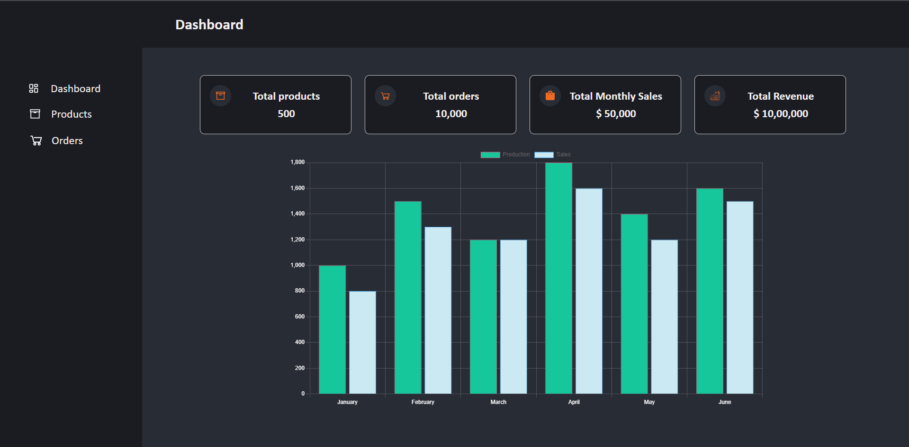
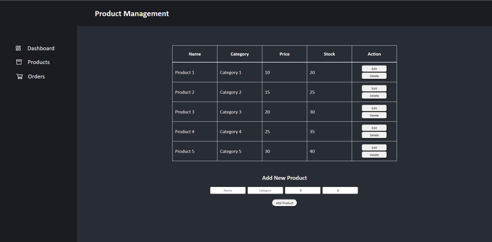
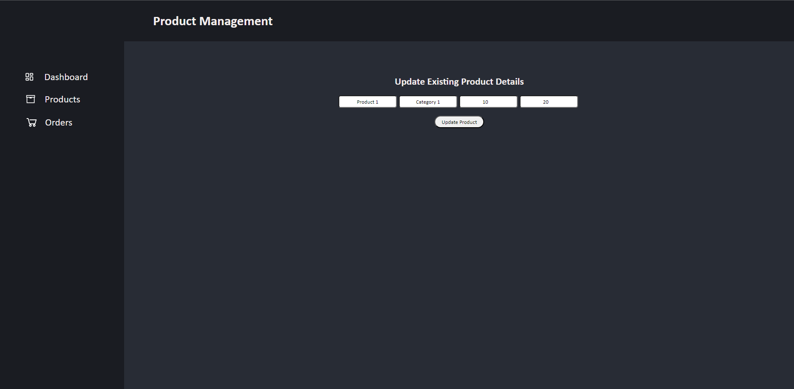
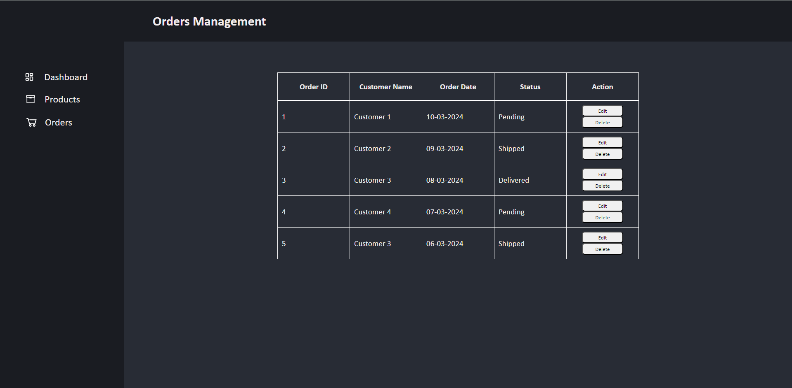
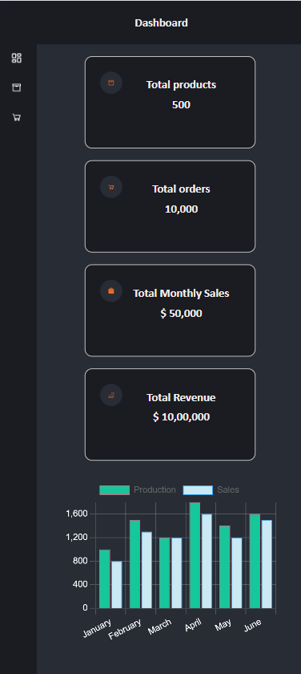

# Project Title:- 
Simplified ERP System

The goal of this project is to create a simplified interface for an ERP (Enterprise Resource
Planning) system, designed to manage basic business operations efficiently.
# Features:-
The system will consist of the following pages: 
1. Dashboard:
- Display a summary of key metrics or features
Include links or buttons for quick navigation to the Products and Orders
management pages.
2. Products Management:
- Present a list of products with details such as name, category, price, and stock
quantity, using mock data
- Enable functionalities to add, edit, and delete products.
3. Orders Management:
- Show a list of orders, including details like order ID, customer name, order date,
and status, using mock data.

# Technologies Used:-
1. React JS
2. Javascript
3. CSS
4. HTML

# Installation:-
You will need to install node and npm globally on your machine before running the project and then follow the following steps:
1. Clone the repository from Github using
```
git clone https://github.com/Mohit-Chordiya/ERP-System.git
```
2. Navigate to the project directory.
3. Install the required dependencies using
```
npm install
```
4. Run the project using
```
npm run dev
```
5. To Visit the Site locally
```
http://localhost:5173/
```

# Demo:-
Check out the live demo here https://erp-system-nine.vercel.app/

# Screenshots with working:-
1. Dashboard Screen:
- The dashboard screen displays the cards with statistics related to the company.
- The bar chart shows the production and sales report of the different years, it also can provide single values of production or sales by clicking on the buttons named production and sales on top of the bar chart.



2. Product Screen:
- The product screen displays the data related to products and provides the functionality of add, edit, and delete products.
- When the edit button is clicked, the window is switched to another interface to enter the data and update the details.





3. Order Screen:
- The order screen displays the data related to pending, shipped, or delivered orders.
- It provides the functionality to change the status of the orders.



4. Following is the mobile view example:


